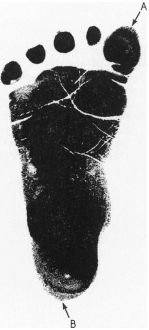
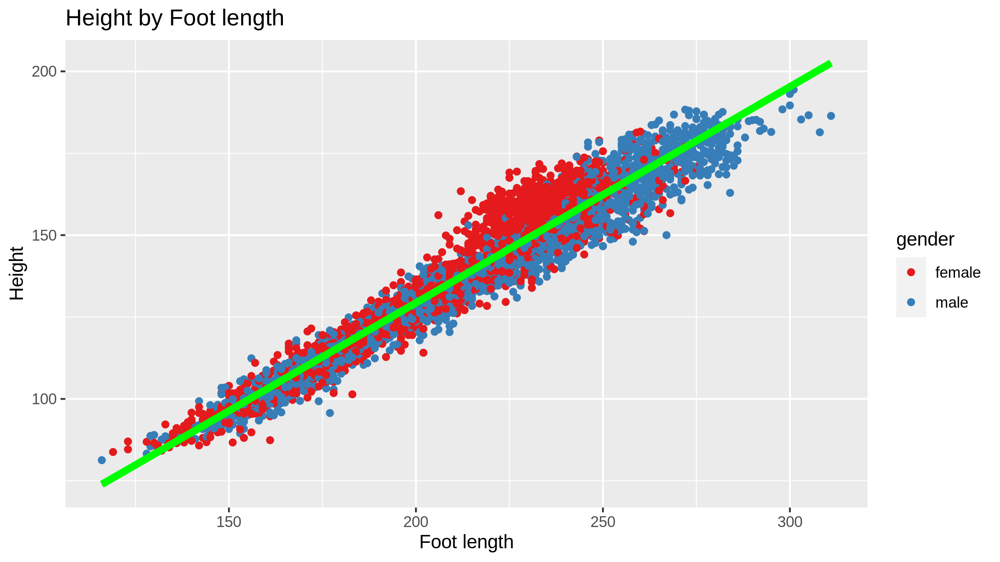
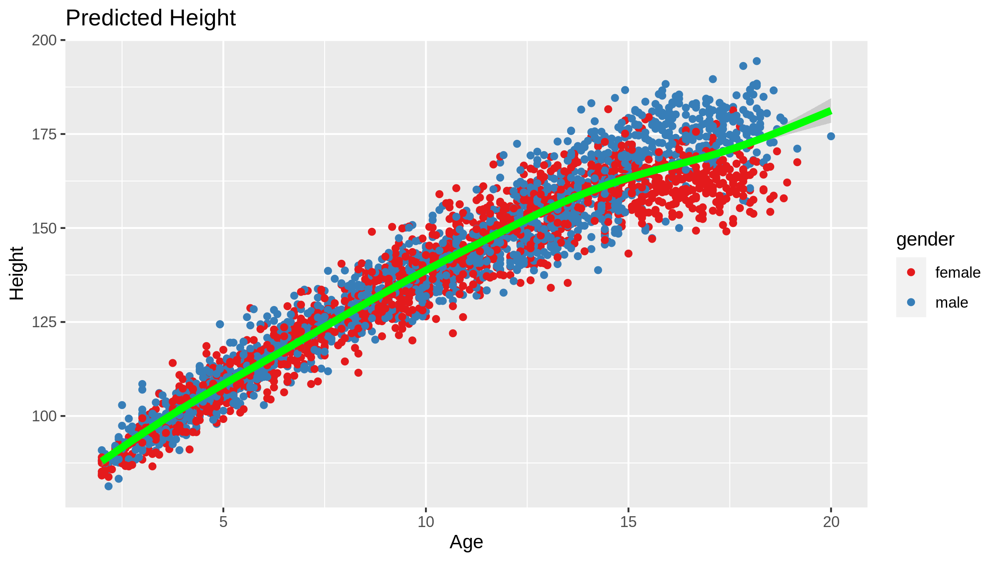

Predict Child Height
========================================================
author: Ricardo Costa
date: 05/21/2020
autosize: true
css:custom.css
class: firstSlide

Helpfull links

- [Shiny App](https://ricardorac.shinyapps.io/myfirstshinyapplication/)

- [App source](https://github.com/ricardorac/ddp_final/tree/master/MyFirstShinyApplication)

- [Presentation source](https://github.com/ricardorac/ddp_final/tree/master/presentation)

***


Child Height and Foot length
========================================================

Since at least 1968 we know that foot length is highly correlated to childs height.

[Ingrid H. E. Rutinhauser](https://adc.bmj.com/content/archdischild/43/229/310.full.pdf) has stated that

*"In young children the estimation of height from foot length could be of value both in field surveys and in the case of deformity"*

In 1977 [Snyder](http://mreed.umtri.umich.edu/mreed/downloads/anthro/child/Snyder_1977_Child.pdf) conducted a research on Anthropometry of infants, children and youths. I used a subset of this data to build this application.


Summary of data
========================================================

This app allows a user to build a prediction model based on Snyder data. Bellow you can see a summary of this data.

Age is measured in years, gender is a male/female factor, foot length is measured in mm and height is measured in cm.


```r
summary(anthropometry)
```

```
      age            gender      foot_length        height     
 Min.   : 2.000   female:1880   Min.   :116.0   Min.   : 81.3  
 1st Qu.: 6.583   male  :1951   1st Qu.:185.0   1st Qu.:118.6  
 Median :10.750                 Median :220.0   Median :141.3  
 Mean   :10.443                 Mean   :214.3   Mean   :138.8  
 3rd Qu.:14.000                 3rd Qu.:240.0   3rd Qu.:158.8  
 Max.   :20.000                 Max.   :311.0   Max.   :194.4  
```

Exploring data
========================================================
left: 70%

Plotting Height by Foot length


***
Fitting a linear model on data shows a high correlation between Height and Foot length

Prediction Model
========================================================
left: 70%
Example of generated prediction model

(GLM with `height ~ foot_length + age + gender`)
***
RMSE on training


```r
RMSE(pred_height_train, training$height)
```

```
[1] 4.252254
```

Expected out-of-sample RMSE


```r
RMSE(pred_height_test, testing$height)
```

```
[1] 4.147699
```
